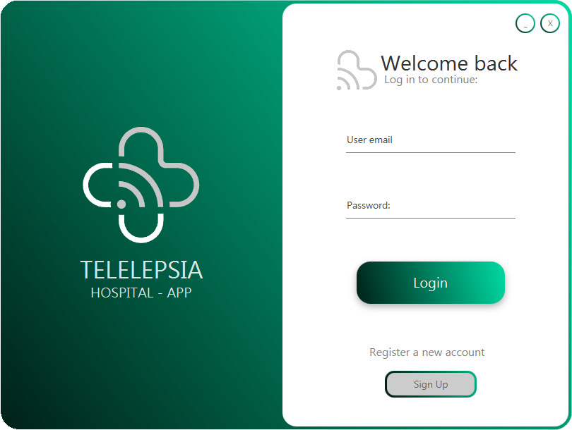
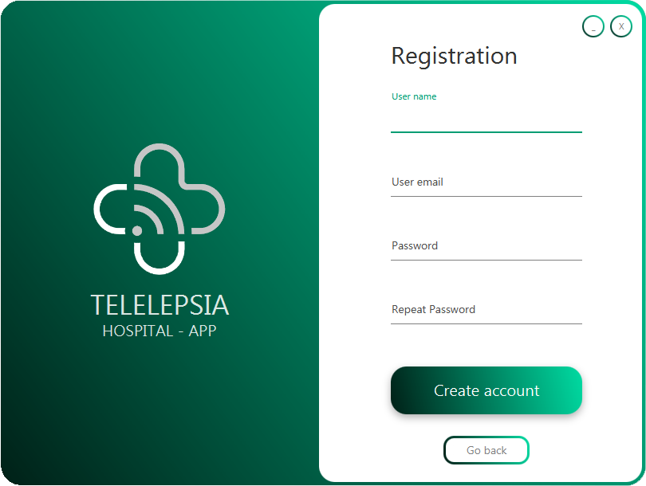

# Telelepsia Doctor Desktop App
## Telemedicine Project (Java 11)

  

-------------------------------
### Index

1. Introduction
2. About the Project
3. Project Set-Up 
4. Doctor Manual

-------------------------------
-------------------------------

## 1. Introduction

This is part of a teledicine project together with two other repositories whose purpose is the supervision from the patient’s home of a chronic disease, in our case Epilepsy. This part of the project is the desktop Java application used by a medical personnel to access the medical data of patients as well ass their data recorded using a BITalino which is stored in a remote server.

### Project Repositories

1. Telemedicine-Doctor-Desktop-App: https://github.com/MiguelOteo/Telemedicine-Doctor-Desktop-App
2. Telemedicine-Patient-Desktop-App: https://github.com/MiguelOteo/Telemedicine-Patient-Desktop-App
3. Telemedicine-Rest-API: https://github.com/MiguelOteo/Telemedicine-Rest-API

-------------------------------
-------------------------------

## 2. About the Project

### About the programming languages:

* Java, version 11 to use more updated libraries
* FXML for the layout files
* XML in the pom.xml for maven project structure, dependencies and compilation process

### JavaFX Project Maven dependencies

This project uses the following Maven dependencies

1. gson dependency: https://mvnrepository.com/artifact/com.google.code.gson/gson
2. json dependency: https://mvnrepository.com/artifact/org.json/json
3. jfoenix 9.0.1 dependency: https://mvnrepository.com/artifact/com.jfoenix/jfoenix/9.0.1
4. chartfx-chart 11.5.1 dependency: https://mvnrepository.com/artifact/de.gsi.chart/chartfx-chart/11.1.5
5. slf4j-simple 2.0.0-alpha0 dependency: https://mvnrepository.com/artifact/org.slf4j/slf4j-simple/2.0.0-alpha0
7. controlsfx 11.1.0 dependency: https://mvnrepository.com/artifact/org.controlsfx/controlsfx/11.1.0

-------------------------------
-------------------------------

## 3. Project Set-Up and compilation

### Project Set-Up

#### On Eclipse
The repository constains the .classpath file from Eclipse IDE, this project should build itself when opened with this IDE without any additional steps.

#### On other IDEs
There could be problems with the structure of the project when opened from a different IDE, you might need to stablish the structure of the project manually.

### Porject compilation

The pom.xml file is designed to compile the project into a fat-jar constaining all the dependencies needed for the project to work, remember that the project will only run on Java 11 or newer.

-------------------------------
-------------------------------

## 4. Doctor Manual

### Log-in and Registration of users (Doctors)
When loading the application the user will see a log-in view to access their accounts, the application checks for a valid password and email.

  

If the user does not have an account they can create one by clicking on the button "sign up", if so a new view will appear for the user to register himself, the application checks all the parameter to not be empyty and to have the correct format.

  

-------------------------------
### Main application menu 
